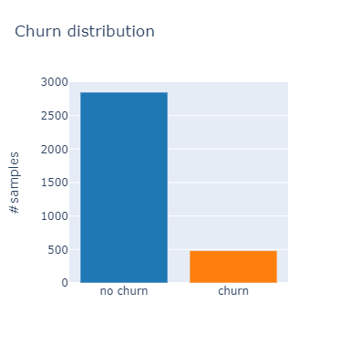
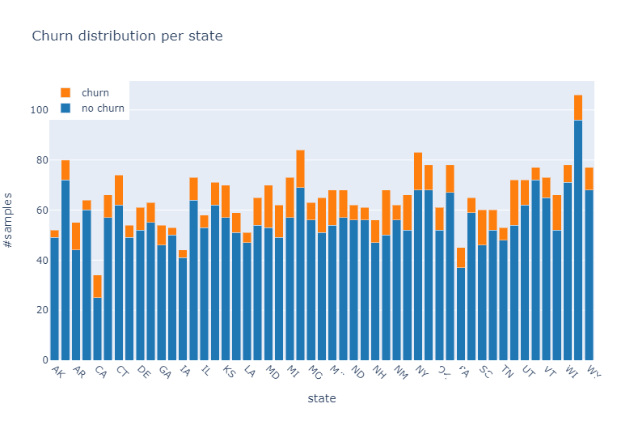
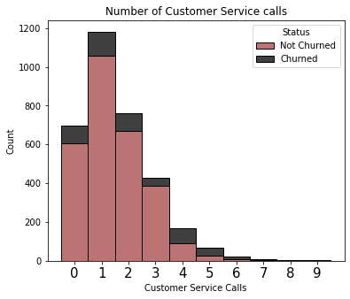
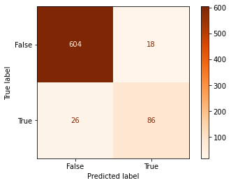

# Phase 3 Project - SyriaTel customer churn

## Project overview
SyriaTel Communications is a Telecommunications company that is looking to predict and prevent customer churn. Customer churn is when a customer leaves/discontinues their service with SyriaTel. Customer churn is a major problem for many service-based companies because it is so expensive. Not only does the company lose the customer’s monthly/yearly payment, but they also incur a customer acquisition cost to replace that customer.

To help SyriaTel fix the problem of customer churn, I first conducted an Exploratory Data Analysis (EDA) and then built a machine learning classifier that will predict the customers that are going to churn. This way, SyriaTel can create a more robust strategy to circumvent their customers from churning.

A project to model customer churn for SyriaTel would involve the following steps:

Data collection: Collect data on SyriaTel's customer base, including demographics, usage patterns, and customer feedback. This data can be obtained from customer surveys, billing records, and other sources.

Data cleaning and preprocessing: Clean and preprocess the data to ensure that it is in a format suitable for analysis. This could include dealing with missing values, transforming variables, and removing irrelevant data.

Exploratory data analysis: Perform exploratory data analysis to gain insights into the patterns and relationships in the data, and identify any potential confounding factors.

Feature selection: Select the most relevant features to include in the model. This could be based on the results of the exploratory data analysis or using other methods such as feature importances from decision trees or LASSO regression.

Model building: Use statistical or machine learning techniques to build a model that predicts customer churn. This could include decision trees, logistic regression, or neural networks, among others.

Model evaluation: Evaluate the performance of the model using metrics such as accuracy, precision, recall, and F1 score, and make any necessary adjustments to improve the model's performance.

Deployment: Deploy the model in a real-world setting, either by integrating it into SyriaTel's existing systems or by developing a standalone application that uses the model to predict customer churn.

Monitoring and evaluation: Monitor the performance of the deployed model and evaluate its effectiveness in reducing customer churn. Make any necessary adjustments to improve its performance over time.

This project aims to help SyriaTel understand the factors that contribute to customer churn and take steps to reduce it, leading to increased customer satisfaction, loyalty, and revenue. By building a predictive model, SyriaTel can better understand the drivers of customer churn and take proactive measures to reduce it, leading to long-term success for the company.

## Business Problem

The business problem of customer churn in the telecommunications industry, including SyriaTel, is to minimize the loss of revenue and customers due to attrition. High customer churn rates can significantly impact a company's revenue and growth, as it means that customers are leaving and not being replaced by new ones at the same rate.

This problem is particularly important for SyriaTel, as the telecommunications industry is highly competitive, and retaining customers is crucial for the company's success. Additionally, the telecommunications industry is characterized by high customer acquisition costs, making it even more important for companies to minimize customer churn and retain their existing customer base.

To address this problem, SyriaTel needs to identify the factors that contribute to customer churn and take action to reduce it. This can include improving customer service, offering more competitive pricing and services, and addressing customer complaints and concerns.

By addressing the business problem of customer churn, SyriaTel can not only reduce its revenue losses but also improve customer satisfaction and increase customer loyalty, leading to long-term growth and success for the company.

## The Data
This project uses the SyriaTel customer churn dataset, which can be found in  `bigml_59c28831336c6604c800002a.csv`
The data for this project will be obtained from a telecom company's customer records, which will include information such as demographic information, service usage data, and customer churn history.

## Methods/technologies used
* data mining
* data understanding
* data cleaning
* data visualization
* predictive model
* machine learning algorithms
* analysis

### Visualization and Results

* churn distribution

* churn distribution per state

* churn distribution vs customer service calls

## Modelings
1.Logistic regression model
2.Decision tree model
3.KNN model
4.Random forest model

## Evaluation metrics

* gradient boosting model
Testing Scores:
Test Accuracy: 0.9400544959128065
Test Precision: 0.8269230769230769
Test Recall: 0.7678571428571429
Test F1-Score: 0.7962962962962962
ROC-AUC: 0.9228582912264585

## Conclusions
The most important factors affecting customer churn are the monthly charges, tenure, and the type of contract. Customers with longer tenures and lower monthly charges are less likely to churn. Customers with monthly contracts are more likely to churn than those with annual or two-year contracts.

# Recommendations
 Offer special promotions and discounts to customers with longer tenures and higher monthly charges to encourage them to stay with the company. Consider offering customers with monthly contracts the option to switch to an annual or two-year contract, which may reduce their likelihood of churning. Conduct surveys and customer feedback programs to better understand why customers are leaving the company and what factors are contributing to their decision to churn.